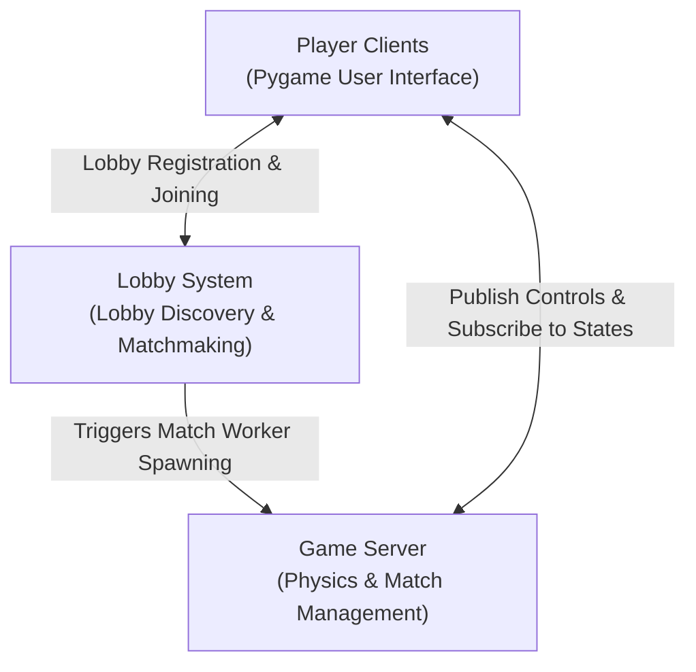

# Arena Battle Robot Game (ROS 2)

An interactive, multi-device 2D robot combat simulator built on ROS 2 (Humble) utilizing a clean, decoupled **Model-View-Controller (MVC)** pattern and a scalable **Master-Worker** process architecture.

The project demonstrates custom ROS 2 message definitions, network lobby discovery, multi-node namespace routing, and real-time visualization using Python and Pygame.

---

## System Architecture & Design Patterns

The project is structured around a distributed MVC design mapped onto ROS 2 nodes, with support for both local single-device gameplay and networked LAN multiplayer.



> [!NOTE]
> For the complete, detailed computation graph showing every single node, topic namespace, and message flow, refer to the **[Complete Architecture Diagram](docs/complete_architecture.md)**.

### 1. Decoupled MVC Pattern
* **Model (The Game Server)**: Implemented in [game_logic.py](src/arena_battle/arena_battle/game_logic.py). It serves as the single source of truth for the game world. It is completely headless, running physics calculations (movement, boundary checks, elastic collisions, and weapon impacts) at 100Hz (`dt = 0.01s`) and broadcasting the updated state.
* **View & Controller (The Pygame Client)**: Implemented in [pygame_visualizer.py](src/arena_battle/arena_battle/pygame_visualizer.py), which composes two mixins:
  * **Controller / Networking**: [networking.py](src/arena_battle/arena_battle/networking.py) — captures keypresses (movement, turret rotation, shields, shooting), publishes commands to the server, and handles lobby discovery/matchmaking.
  * **View / Rendering**: [rendering.py](src/arena_battle/arena_battle/rendering.py) — subscribes to the server's broadcasted state and renders the arena, scores, ammunition, health levels, and local particle/trail animations at 60 FPS.

### 2. Multi-Match Master-Worker Architecture
To support multiple concurrent match sessions over a single ROS 2 network (`ROS_DOMAIN_ID`) without cross-talk:
1. **The Game Master Node**: The main `/game_server` node runs continuously as a coordinator. It subscribes to the `/lobby_advertisement` discovery channel.
2. **Dynamic Process Spawning**: When the host visualizer starts a match, it advertises the lobby status as `playing` with a unique `match_id`. The Game Master detects this transition and spawns a dedicated OS subprocess running a match worker:
   ```bash
   ros2 run arena_battle game_logic -- --match-id mXXXXXX
   ```
3. **Namespaced Isolation**: The match worker operates under a distinct node name (`/game_server_mXXXXXX`) and binds to namespaced topics:
   * `/match/mXXXXXX/p1/command` (Player 1 Input)
   * `/match/mXXXXXX/p2/command` (Player 2 Input)
   * `/match/mXXXXXX/game_state` (Server State Output)
4. **Automatic Resource Reclamation (Client Watchdog)**: To prevent stray server processes from accumulating, the match worker runs a 5.0-second inactivity watchdog. If no inputs are received from either player for 5 seconds (e.g., when a player quits or loses connection), the worker process safely shuts down.

### 3. Local vs. Network LAN Play Modes
The codebase operates under two distinct network modes configured dynamically from the visualizer's GUI:
* **Local Mode (Single Device)**: The visualizer spawns a local server process directly. Both Player 1 (WASD) and Player 2 (Arrow keys) commands are routed over global non-namespaced topics (`/p1/command`, `/p2/command`, and `/global_game_state`).
* **LAN Multiplayer Mode (Distributed Devices)**: Discovery, handshakes, and matchmaking occur over network-wide discovery topics using serialized JSON string messages. Once a guest joins a host's lobby, the game switches to namespaced match topics.

---

## Data Schemas (Custom ROS 2 Message Interfaces)

All messages are defined inside the [arena_battle_interfaces](src/arena_battle_interfaces) package to ensure type-safe serialization:

| Message | File Link | Purpose / Key Fields |
| :--- | :--- | :--- |
| **`RobotCombatCommand`** | [RobotCombatCommand.msg](src/arena_battle_interfaces/msg/RobotCombatCommand.msg) | Transmits controller inputs. Contains linear/angular speed variables, absolute turret orientation angle, shoot/shield flags, and weapon type identifier. |
| **`RobotState`** | [RobotState.msg](src/arena_battle_interfaces/msg/RobotState.msg) | Describes a single robot's status. Contains chassis pose (x, y, theta), turret rotation angle, HP, ammunition, shields status, energy, and total score. |
| **`Projectile`** | [Projectile.msg](src/arena_battle_interfaces/msg/Projectile.msg) | Details a weapon projectile. Tracks unique tracking ID, current coordinates, velocity vectors, weapon type, and player owner ID. |
| **`GameState`** | [GameState.msg](src/arena_battle_interfaces/msg/GameState.msg) | Broadcasts the complete game state. Bundles `player1` and `player2` (`RobotState` structs), a list of active `projectiles` (`Projectile[]`), round duration, and game over status. |

---

## Lifecycle & Execution Sequences

### A. Match Discovery & Lobby Joining Sequence
```text
[Guest Client (MENU)] ──► Subscribes to `/lobby_advertisement`
                               ▲
                               │ (Regularly broadcasts host status)
[Host Client (LOBBY_HOST)] ────┼──► Publishes JSON to `/lobby_advertisement`
                               │
[Guest Client] ────────────────┼──► Clicks "JOIN" ──► Publishes JSON to `/lobby_join_request`
                               │
[Host Client] ─────────────────┴──► Receives Join Request ──► Sets state to "READY"
                                    (Advertises lobby status as "ready")
```

### B. Gameplay Execution Loop
```text
  Pygame Client (GUI)                   Namespaced ROS Topics                 Match Worker Server
┌─────────────────────────┐             ┌─────────────────────┐             ┌─────────────────────────┐
│ Polling keyboard inputs │             │                     │             │                         │
│ Frame rate: 60 FPS      │             │                     │             │                         │
│                         │             │                     │             │                         │
│ Translate keys to       │             │                     │             │                         │
│ RobotCombatCommand msg  ├────────────►│  /match/id/command  ├────────────►│ Read commands & update  │
│                         │             │                     │             │ target velocities       │
│                         │             │                     │             │                         │
│                         │             │                     │             │ Run physics loop (100Hz)│
│                         │             │                     │             │ * Move & bounds check   │
│                         │             │                     │             │ * Push collision checks │
│                         │             │                     │             │ * Projectile steps      │
│                         │             │                     │             │ * HP & hit calculations │
│                         │             │                     │             │                         │
│ Render updated screen   │◄────────────┤ /match/id/game_state│◄────────────┤ Pack & publish          │
│ * Draw robots & arena   │             │                     │             │ GameState message       │
│ * Draw projectiles      │             │                     │             │                         │
│ * Animate trails/flashes│             │                     │             │                         │
└─────────────────────────┘             └─────────────────────┘             └─────────────────────────┘
```

---

## Setup & How to Run

### 1. Prerequisites
Ensure you have **ROS 2 Humble** installed and the `pygame` library installed:
```bash
sudo apt update
sudo apt install ros-humble-desktop
pip install pygame
```

### 2. Building the Workspace
Always build the ROS 2 packages from the root directory of your workspace (`/home/syphon/arena_battle`):
```bash
cd /home/syphon/arena_battle
colcon build --symlink-install
```

### 3. Sourcing the Environment
The ROS 2 workspace environment must be sourced in **every new terminal** window before running packages:
```bash
source /home/syphon/arena_battle/install/setup.bash
```

### 4. Running the Nodes

* **Option A: Using Shortcut Scripts (Recommended for LAN multiplayer)**
  * **Start the Game Master Server**:
    ```bash
    ./runserver
    ```
  * **Start the Game Client (Pygame Visualizer)**:
    ```bash
    ./rungame
    ```

* **Option B: Running ROS 2 Commands Directly**
  * **Start the Game Server**:
    ```bash
    ros2 launch arena_battle game_server.launch.py
    ```
  * **Start the Client Node**:
    ```bash
    ros2 launch arena_battle game_client.launch.py
    ```

* **Option C: `ros2 launch` (native ROS 2 alternative to the shortcut scripts)**
  * **Start the Game Server** (terminal 1):
    ```bash
    ros2 launch arena_battle game_server.launch.py
    ```
  * **Start the Game Client** (terminal 2):
    ```bash
    ros2 launch arena_battle game_client.launch.py
    ```
  Both launch files pin `ROS_DOMAIN_ID=67` so the two processes find each other automatically. Once the client window opens, click **LOCAL MATCH (1 LAPTOP)** — it detects the already-running server and won't spawn a duplicate one.

---

## Controls (Active when Pygame Window is Focused)

### 1. Shared Keyboard Mode (Single Device Local Match)
| Action | Player 1 (Cyan Robot) | Player 2 (Magenta Robot) |
| :--- | :--- | :--- |
| **Move Forward / Backward** | `W` / `S` | `Up Arrow` / `Down Arrow` |
| **Rotate Chassis Left / Right** | `A` / `D` | `Left Arrow` / `Right Arrow` |
| **Rotate Turret Left / Right** | `J` / `L` | `[` / `]` or `,` / `.` |
| **Shoot Normal Projectile** | `Space` | `Enter` |
| **Activate Shield Bubble** | `Q` | `Right Ctrl` |
| **Special 8-Way Attack** | `E` | `Right Shift` |

### 2. Network Mode (LAN Multiplayer)
| Action | Key Binding | Description |
| :--- | :--- | :--- |
| **Move Chassis** | `W` / `S` (Forward/Backward), `A` / `D` (Rotate) | Navigates the robot base in the arena. |
| **Rotate Turret** | `J` / `L` | Independently rotates the aim angle of the gun turret. |
| **Shoot Normal** | `Space` | Fires a standard shot (costs 1 ammo; automatically regenerates). |
| **Activate Shield** | `Q` | Deploys a temporary protective barrier (costs 30 shield energy). |
| **Special 8-Way Attack**| `E` | Fires an 8-way radial projectile attack (costs 5 ammo). |
| **Pause Menu / Exit** | `ESC` | Pauses/unpauses the game or triggers the quit menu. |

---

## Project Directory Structure

```text
arena_battle/
├── src/
│   ├── arena_battle_interfaces/      # Custom ROS 2 serialization interfaces
│   │   ├── msg/
│   │   │   ├── Projectile.msg        # Projectile tracking structure
│   │   │   ├── RobotCombatCommand.msg# Controller actions schema
│   │   │   ├── RobotState.msg        # Vehicle details schema
│   │   │   └── GameState.msg         # Entire arena game status bundle
│   │   └── CMakeLists.txt            # Interface build recipe
│   │
│   └── arena_battle/                 # Core Python source package
│       ├── arena_battle/
│       │   ├── game_logic.py         # Headless Game server (Master & Worker logic)
│       │   ├── pygame_visualizer.py  # Node class + main loop, combines the mixins below
│       │   ├── networking.py         # NetworkMixin: ROS topics, lobby/matchmaking, command pub
│       │   └── rendering.py          # RenderMixin: all pygame drawing/rendering
│       ├── launch/
│       │   └── arena_battle.launch.py# Node launcher script
│       └── setup.py                  # Python package configuration
│
│── README.md                         # Architecture, Setup, and Controls (This file)
│── runserver                         # Game Master launching shortcut script
└── rungame                           # Visualizer client launching shortcut script
```
