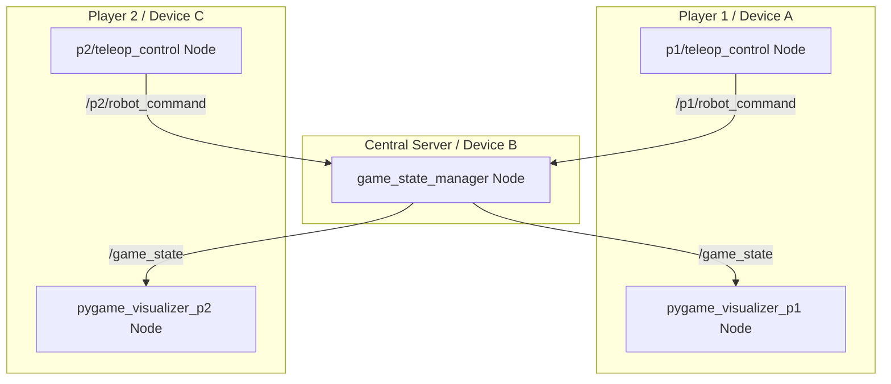

# Arena Battle Robot Game (ROS 2)

An interactive, multi-device 2D robot combat simulator built on ROS 2 (Humble) utilizing a clean, decoupled **Model-View-Controller (MVC)** architectural pattern. 

The project demonstrates custom ROS 2 message definition, nested message structures, multi-node topic communication, and real-time interactive visualization using Python and Pygame.

---

## 🏗️ MVC Architecture & Data Flow

The application is split into separate ROS nodes representing the Model, View, and Controller layers to show proper decoupling:



---

## 🔍 Detailed Program Breakdown

### 1. The ROS 2 Nodes (Who they are & What they do)

*   **`game_state_manager`** (Model / State Server Node)
    *   **Defined in**: [game_logic.py](file:///home/kolboth/arena_battle/src/arena_battle/arena_battle/game_logic.py).
    *   **Role**: Acts as the game server. It runs the physics engine, tracks all global game states, handles boundaries, resolves robot-to-robot pushing collisions, and processes projectile damage.
    *   **Subscribes to**: `/p1/robot_command` and `/p2/robot_command`.
    *   **Publishes to**: `/game_state`.

*   **`pygame_visualizer`** (View / Pure Renderer Node)
    *   **Defined in**: [pygame_visualizer.py](file:///home/kolboth/arena_battle/src/arena_battle/arena_battle/pygame_visualizer.py).
    *   **Role**: A pure rendering GUI. It displays the arena, active robots, particles, projectles, and a side-by-side dashboard HUD. It does not handle user keyboard inputs or publish commands directly.
    *   **Subscribes to**: `/game_state`.
    *   **Publishes to**: *None*.

*   **`teleop_control`** (Controller / Terminal Input Node)
    *   **Defined in**: [teleop_control.py](file:///home/kolboth/arena_battle/src/arena_battle/arena_battle/teleop_control.py).
    *   **Role**: Runs inside the console terminal. It reads raw character-by-character key presses from the terminal stdin and publishes control commands.
    *   **Subscribes to**: *None*.
    *   **Publishes to**: `/robot_command` (automatically remapped to `/p1/robot_command` or `/p2/robot_command` depending on the namespace).

---

### 2. Custom ROS 2 Messages (What they are & Where they are defined)

All custom interfaces are defined inside the **`arena_battle_interfaces`** package:

*   **`RobotCombatCommand`**
    *   **File**: [RobotCombatCommand.msg](file:///home/kolboth/arena_battle/src/arena_battle_interfaces/msg/RobotCombatCommand.msg)
    *   **Fields**:
        *   `float32 linear_velocity` / `float32 angular_velocity` (movement commands)
        *   `bool shoot` / `bool shield` / `uint8 weapon_type` (combat actions)
        *   `float32 turret_angle` (absolute aim angle relative to the chassis)

*   **`Projectile`**
    *   **File**: [Projectile.msg](file:///home/kolboth/arena_battle/src/arena_battle_interfaces/msg/Projectile.msg)
    *   **Fields**:
        *   `int32 id` (unique identifier)
        *   `float32 x` / `float32 y` / `float32 vx` / `float32 vy` (coordinates and speeds)
        *   `uint8 type` (0 = Normal, 1 = Special attack)
        *   `uint8 owner` (1 = Player 1, 2 = Player 2)

*   **`RobotState`**
    *   **File**: [RobotState.msg](file:///home/kolboth/arena_battle/src/arena_battle_interfaces/msg/RobotState.msg)
    *   **Fields**:
        *   `float32 x` / `float32 y` / `float32 theta` (robot pose)
        *   `float32 turret_angle` (aim joint state)
        *   `int32 health` / `int32 score` / `int32 ammo` (statistics)
        *   `bool shield_active` / `float32 shield_energy` (defensive status)

*   **`GameState`**
    *   **File**: [GameState.msg](file:///home/kolboth/arena_battle/src/arena_battle_interfaces/msg/GameState.msg)
    *   **Fields**:
        *   `RobotState player1` / `RobotState player2` (individual player statuses)
        *   `Projectile[] projectiles` (list of active projectiles in the arena)
        *   `bool game_over` / `float32 time_elapsed` (global session parameters)

---

## 🔄 Execution Under the Hood (Step-by-Step Flow)

```text
[User presses 'Space' in Player 1 Terminal Node]
                     │
                     ▼
1. p1/teleop_control publishes `RobotCombatCommand` (shoot=True) to `/p1/robot_command`
                     │
                     ▼
2. game_state_manager receives the command, decrements Player 1 ammo, and spawns a projectile
                     │
                     ▼
3. game_state_manager physics loop (50Hz) updates positions and compiles `GameState` message
                     │
                     ▼
4. game_state_manager publishes `GameState` to `/game_state`
                     │
                     ▼
5. pygame_visualizer_p1 and pygame_visualizer_p2 receive the state, update HUDs, 
   spawn muzzle flash particles, and draw moving projectiles on both screens
```

---

## 📂 Directory Structure

```text
arena_battle/
├── src/
│   ├── arena_battle_interfaces/      # Custom ROS 2 message interface package
│   │   ├── msg/
│   │   │   ├── Projectile.msg        # Projectile definition
│   │   │   ├── RobotCombatCommand.msg# User commands definition
│   │   │   ├── RobotState.msg        # Single robot state definition
│   │   │   └── GameState.msg         # Global game state definition
│   │   └── CMakeLists.txt            # Interface compiler configuration
│   │
│   └── arena_battle/                 # Main Python package
│       ├── arena_battle/
│       │   ├── game_logic.py         # State Manager node (server)
│       │   ├── pygame_visualizer.py  # GUI View node (pure rendering client)
│       │   └── teleop_control.py     # Terminal Controller node (client input)
│       ├── launch/
│       │   └── arena_battle.launch.py# Launch script for server & visualizers
│       └── setup.py                  # Package installation file
│
│── README.md                         # Main description (This file)
└── launch.md                         # Build & Launch instructions
```

---

## 🚀 How to Run the Project

For instructions on compiling, sourcing, and operating the simulator, refer to the **[launch.md](file:///home/kolboth/arena_battle/launch.md)** guide.
