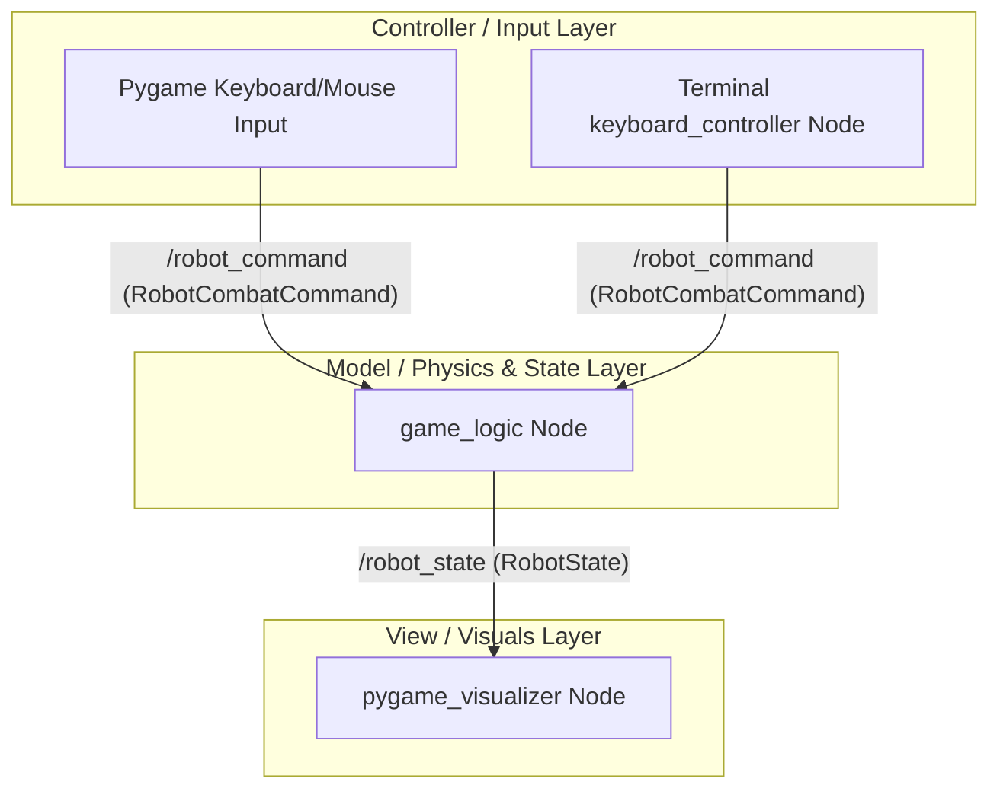

# Arena Battle Robot Game (ROS 2)

An interactive, 2D robot combat simulator built on ROS 2 (Humble) utilizing a clean **Model-View-Controller (MVC)** architectural pattern. 

The project demonstrates custom ROS 2 message definition, nested message structures, multi-node topic communication, and real-time interactive visualization using Python and Pygame.

---

## 🏗️ MVC Architecture & Data Flow

The application is split into separate ROS nodes representing the Model, View, and Controller layers to show proper decoupling:



---

## 🔍 Detailed Program Breakdown

### 1. The ROS 2 Nodes (Who they are & What they do)

*   **`game_logic`** (Model / State Node)
    *   **Defined in**: [game_logic.py](file:///home/kolboth/arena_battle/src/arena_battle/arena_battle/game_logic.py) (inside the `arena_battle` package).
    *   **Role**: Acts as the game server. It runs the physics engine and tracks all global game states.
    *   **Logic**:
        *   Receives movement commands and maps coordinate adjustments.
        *   Keeps the robot inside the circular boundary (checks bounds).
        *   Fires projectiles and updates their positions.
        *   Tracks player health, shield durations, score, and ammo.
        *   Runs an update loop at **50Hz** to publish the current state.
    *   **Subscribes to**: `/robot_command`
    *   **Publishes to**: `/robot_state`

*   **`pygame_visualizer`** (View & GUI Controller Node)
    *   **Defined in**: [pygame_visualizer.py](file:///home/kolboth/arena_battle/src/arena_battle/arena_battle/pygame_visualizer.py) (inside the `arena_battle` package).
    *   **Role**: Acts as the game client and main user interface.
    *   **Logic**:
        *   **View**: Receives `/robot_state` and draws the robot chassis, rotating turret, active shield, moving projectiles, score, HP, and ammo panels.
        *   **Local Visuals**: Spawns exhaust trails, muzzle flashes, and wall impact explosions by monitoring when new projectiles appear or disappear from the state.
        *   **Controller**: Captures keyboard (`W`/`A`/`S`/`D`/`Space`/`Q`/`E`) and mouse movement/clicking events within the GUI window and publishes them.
    *   **Subscribes to**: `/robot_state`
    *   **Publishes to**: `/robot_command`

*   **`keyboard_controller`** (Alternate Controller Node)
    *   **Defined in**: [keyboard_controller.py](file:///home/kolboth/arena_battle/src/arena_battle/arena_battle/keyboard_controller.py) (inside the `arena_battle` package).
    *   **Role**: Acts as a terminal-based controller (optional, runs in a separate terminal).
    *   **Logic**:
        *   Reads raw character-by-character key presses from the terminal stdin and publishes command events.
    *   **Subscribes to**: *None*
    *   **Publishes to**: `/robot_command`

---

### 2. Custom ROS 2 Messages (What they are & Where they are defined)

All custom interfaces are defined inside the **`arena_battle_interfaces`** package:

*   **`RobotCombatCommand`**
    *   **File**: [RobotCombatCommand.msg](file:///home/kolboth/arena_battle/src/arena_battle_interfaces/msg/RobotCombatCommand.msg)
    *   **Fields**:
        *   `float32 linear_velocity` / `float32 angular_velocity` (move commands)
        *   `bool shoot` / `bool shield` / `uint8 weapon_type` (combat actions)
        *   `float32 turret_angle` (aim commands)
    *   **Who uses it**: Published by `pygame_visualizer` or `keyboard_controller` and subscribed to by `game_logic`.

*   **`Projectile`**
    *   **File**: [Projectile.msg](file:///home/kolboth/arena_battle/src/arena_battle_interfaces/msg/Projectile.msg)
    *   **Fields**:
        *   `int32 id` (unique identifier)
        *   `float32 x` / `float32 y` (position coordinates)
        *   `float32 vx` / `float32 yv` (velocity components)
        *   `uint8 type` (0 = Normal, 1 = Special attack)
    *   **Who uses it**: Nested as an array inside `RobotState.msg` to pass projectile details from the Model to the View.

*   **`RobotState`**
    *   **File**: [RobotState.msg](file:///home/kolboth/arena_battle/src/arena_battle_interfaces/msg/RobotState.msg)
    *   **Fields**:
        *   `float32 x` / `float32 y` / `float32 theta` (robot pose)
        *   `float32 turret_angle` (aim joint state)
        *   `int32 health` / `int32 score` / `int32 ammo` (game statistics)
        *   `bool shield_active` / `float32 shield_energy` (defensive status)
        *   `bool game_over` / `float32 time_elapsed` (session parameters)
        *   `Projectile[] projectiles` (active projectile list)
    *   **Who uses it**: Published by `game_logic` and subscribed to by `pygame_visualizer`.

---

## 🔄 Execution Under the Hood (Step-by-Step Flow)

```text
[User presses 'Space' in Pygame GUI]
               │
               ▼
1. pygame_visualizer publishes `RobotCombatCommand` (with shoot=True) to `/robot_command`
               │
               ▼
2. game_logic receives the command, checks ammo, decrements it, and spawns a projectile dict
               │
               ▼
3. game_logic physics loop (50Hz) moves the projectile coordinates and compiles `RobotState`
               │
               ▼
4. game_logic publishes the compiled `RobotState` (including the new Projectile) to `/robot_state`
               │
               ▼
5. pygame_visualizer receives the state, detects a new projectile ID, spawns a muzzle flash, 
   and draws the projectile moving smoothly on screen
```

---

## 📂 Directory Structure

```text
arena_battle/
├── src/
│   ├── arena_battle_interfaces/      # Custom ROS 2 message interface package
│   │   ├── msg/
│   │   │   ├── Projectile.msg        # Projectile definition
│   │   │   ├── RobotCombatCommand.msg# User commands definition
│   │   │   └── RobotState.msg        # Global game state definition
│   │   └── CMakeLists.txt            # Interface compiler configuration
│   │
│   └── arena_battle/                 # Main Python package
│       ├── arena_battle/
│       │   ├── game_logic.py         # State/Model node
│       │   ├── pygame_visualizer.py  # GUI View/Controller node
│       │   └── keyboard_controller.py# Optional terminal controller node
│       ├── launch/
│       │   └── arena_battle.launch.py# Node launcher script
│       └── setup.py                  # Package installation file
│
├── venv/                             # Python Virtual Environment
├── README.md                         # Main description (This file)
└── launch.md                         # Build & Launch instructions
```

---

## 🚀 How to Run the Project

For instructions on compiling, sourcing, and operating the simulator, refer to the **[launch.md](file:///home/kolboth/arena_battle/launch.md)** guide.
