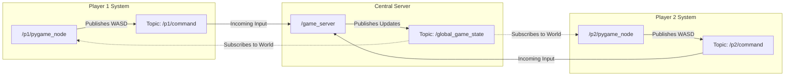

# Arena Battle Robot Game (ROS 2)

An interactive, multi-device 2D robot combat simulator built on ROS 2 (Humble) utilizing a clean, decoupled **Model-View-Controller (MVC)** architectural pattern.

The project demonstrates custom ROS 2 message definition, nested message structures, multi-node topic communication, and real-time interactive visualization using Python and Pygame.

---

## 🏗️ MVC Architecture & Data Flow

The application is split into separate ROS nodes representing the Model (server physics and state tracker) and the View/Controller (unified Pygame client that captures input and renders the game):



---

## 🔍 Visualizing the Network Topology with `rqt_graph`

To verify and observe how the nodes communicate in real-time, you can use the ROS 2 computation graph visualizer:

```bash
ros2 run rqt_graph rqt_graph
```


This starts a GUI displaying the active ROS 2 graph. For a comprehensive, step-by-step description of every node and topic arrow, refer to [rqt_graph_explanation.md](file:///home/syphon/arena_battle/rqt_graph_explanation.md). Below is an overview of what the shapes, text, and arrows mean:

### 1. The Components of the Graph
* **Ovals / Circles (Nodes)**: Each circle represents a running ROS 2 Node (an active executable process).
  * `/game_server`: The central physics server.
  * `/p1/pygame_node` & `/p2/pygame_node`: The client nodes capturing player inputs and rendering the game.
* **Rectangles / Boxes (Topics)**: Each box represents a ROS 2 Topic (the communication channel).
  * `/p1/command` & `/p2/command`: Keyboard command payloads sent from the visualizers to the server.
  * `/global_game_state`: The global game state payload broadcasted by the server back to all visualizers.
  * `/lobby_advertisement`: Broadcasts lobby statuses (player names, host ID, ready state) for game discovery and server state sync.
  * `/lobby_join_request`: Transmits request payloads from guest clients to join a hosted multiplayer lobby.
* **Directed Arrows (Data Flow)**:
  * An arrow **from a Node to a Topic** means the node is **publishing** messages (writing data).
  * An arrow **from a Topic to a Node** means the node is **subscribing** to messages (reading data).

> [!NOTE]
> If you select **"Nodes only"** in the `rqt_graph` options menu, topics are omitted as boxes. Instead, arrows point directly from the publisher node to the subscriber node, labeled with the topic name.

### 2. Reading the Real-time Data Flow
By tracking the arrow paths, you can see the complete closed feedback loop between the nodes:

```text
[/p1/pygame_node or /p2/pygame_node] (Captures focused keystrokes)
       │ 
       ▼ (Publishes commands)
Topic: `/p1/command` or `/p2/command`
       │ 
       ▼ (Delivered to Server)
[/game_server] (Processes inputs, runs physics & collision logic)
       │ 
       ▼ (Publishes updated state)
Topic: `/global_game_state`
       │ 
       ▼ (Broadcasted to displays)
[/p1/pygame_node or /p2/pygame_node] (Renders new positions, scores, and particles)
```

---

## 🔍 Detailed Program Breakdown

### 1. The ROS 2 Nodes (Who they are & What they do)

*   **`game_server`** (Model / State Server Node)
    *   **Defined in**: [game_logic.py](file:///home/syphon/arena_battle/src/arena_battle/arena_battle/game_logic.py).
    *   **Role**: Acts as the game server. It runs the physics engine, tracks all global game states, handles boundaries, resolves robot-to-robot pushing collisions, and processes projectile damage.
    *   **Subscribes to**: `/p1/command` and `/p2/command`.
    *   **Publishes to**: `/global_game_state`.

*   **`pygame_node`** (View & Controller / Unified GUI Client)
    *   **Defined in**: [pygame_visualizer.py](file:///home/syphon/arena_battle/src/arena_battle/arena_battle/pygame_visualizer.py).
    *   **Role**: A unified GUI client node running as `/p1/pygame_node` or `/p2/pygame_node`. It displays the arena, active robots, particles, projectiles, and dashboard HUD. Simultaneously, it captures user keyboard events while the window is focused and publishes real-time driving and action commands.
    *   **Subscribes to**: `/global_game_state`.
    *   **Publishes to**: `/p1/command` (from Player 1 system) or `/p2/command` (from Player 2 system).
---

### 2. Custom ROS 2 Messages (What they are & Where they are defined)

All custom interfaces are defined inside the **`arena_battle_interfaces`** package:

*   **`RobotCombatCommand`**
    *   **File**: [RobotCombatCommand.msg](file:///home/syphon/arena_battle/src/arena_battle_interfaces/msg/RobotCombatCommand.msg)
    *   **Fields**:
        *   `float32 linear_velocity` / `float32 angular_velocity` (movement commands)
        *   `bool shoot` / `bool shield` / `uint8 weapon_type` (combat actions)
        *   `float32 turret_angle` (absolute aim angle relative to the chassis)

*   **`Projectile`**
    *   **File**: [Projectile.msg](file:///home/syphon/arena_battle/src/arena_battle_interfaces/msg/Projectile.msg)
    *   **Fields**:
        *   `int32 id` (unique identifier)
        *   `float32 x` / `float32 y` / `float32 vx` / `float32 vy` (coordinates and speeds)
        *   `uint8 type` (0 = Normal, 1 = Special attack)
        *   `uint8 owner` (1 = Player 1, 2 = Player 2)

*   **`RobotState`**
    *   **File**: [RobotState.msg](file:///home/syphon/arena_battle/src/arena_battle_interfaces/msg/RobotState.msg)
    *   **Fields**:
        *   `float32 x` / `float32 y` / `float32 theta` (robot pose)
        *   `float32 turret_angle` (aim joint state)
        *   `int32 health` / `int32 score` / `int32 ammo` (statistics)
        *   `bool shield_active` / `float32 shield_energy` (defensive status)

*   **`GameState`**
    *   **File**: [GameState.msg](file:///home/syphon/arena_battle/src/arena_battle_interfaces/msg/GameState.msg)
    *   **Fields**:
        *   `RobotState player1` / `RobotState player2` (individual player statuses)
        *   `Projectile[] projectiles` (list of active projectiles in the arena)
        *   `bool game_over` / `float32 time_elapsed` (global session parameters)

---

## 🔄 Execution Under the Hood (Step-by-Step Flow)

```text
[User presses 'Space' in pygame_node GUI Window]
                     │
                     ▼
1. pygame_node publishes `RobotCombatCommand` (shoot=True) to `/p1/command`
                     │
                     ▼
2. game_server receives the command, decrements Player 1 ammo, and spawns a projectile
                     │
                     ▼
3. game_server physics loop (50Hz) updates positions and compiles `GameState` message
                     │
                     ▼
4. game_server publishes `GameState` to `/global_game_state`
                     │
                     ▼
5. pygame_node receives the state, updates the HUD, spawns particles, and draws moving projectiles
```

---

## 📂 Directory Structure

```text
arena_battle/
├── src/
│   ├── arena_battle_interfaces/      # Custom ROS 2 message interface package
│   │   ├── msg/
│   │   │   ├── Projectile.msg        # Projectile definition
│   │   │   ├── RobotCombatCommand.msg# User commands definition
│   │   │   ├── RobotState.msg        # Single robot state definition
│   │   │   └── GameState.msg         # Global game state definition
│   │   └── CMakeLists.txt            # Interface compiler configuration
│   │
│   └── arena_battle/                 # Main Python package
│       ├── arena_battle/
│       │   ├── game_logic.py         # State Manager node (server)
│       │   ├── pygame_visualizer.py  # GUI client node (View & Controller)
│       │   └── teleop_control.py     # Optional console controller
│       ├── launch/
│       │   └── arena_battle.launch.py# Launch script for visualizer
│       └── setup.py                  # Package installation file
│
│── README.md                         # Main description (This file)
│── launch.md                         # Build & Launch instructions
│── runserver                         # Server startup script
└── rungame                           # Game client startup script
```

---

## 🚀 How to Run the Project

For detailed instructions on compiling, sourcing, and operating the simulator, refer to the **[launch.md](file:///home/syphon/arena_battle/launch.md)** guide.
