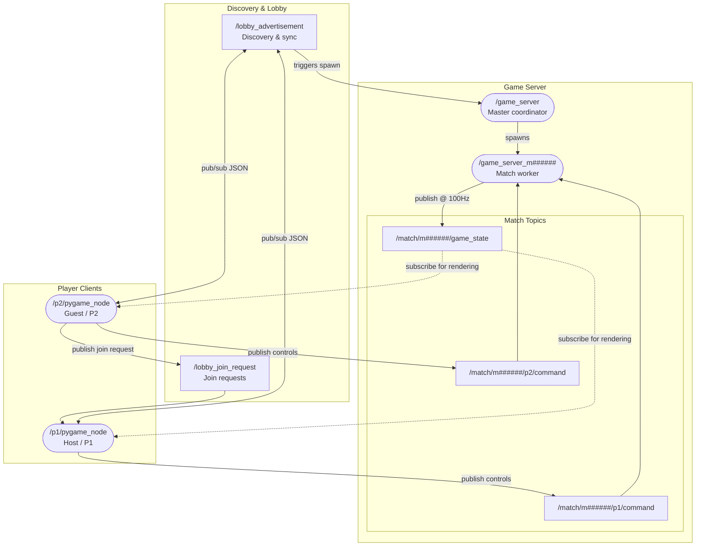

# Complete Project Architecture

This document contains the complete, detailed computation graph of the Arena Battle Robot Game, mapping out every node, topic namespace, and connection in the system.

## Complete Computation Graph

For simplified, isolated views of these components, refer to:
* **[Game Server Architecture](game_server_architecture.md)**
* **[Lobby Discovery & Matchmaking Flow](lobby_discovery.md)**
* **[Gameplay Match Communication Flow](match_gameplay.md)**
