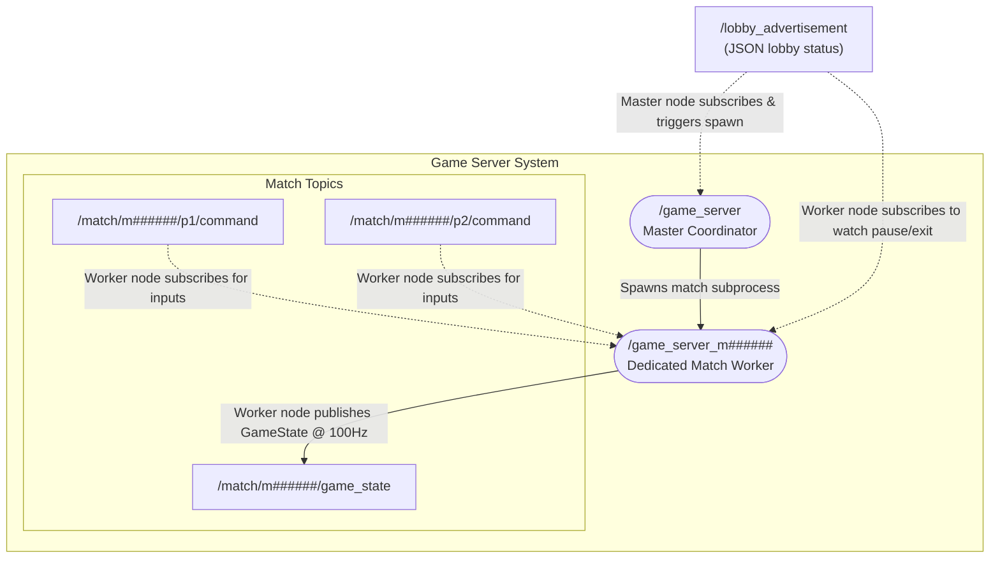

# Game Server Architecture

This document provides an isolated, detailed view of the **Game Server System** block, illustrating how the coordinator process spawns dedicated worker subprocesses and how topics are namespaced for isolated multiplayer matches.

## Headless Server System Graph

The diagram below details the boundary of the `/game_server` coordinator and its spawned worker nodes:



## Architectural Roles & Spawning Mechanism

### 1. Master Coordinator Node (`/game_server`)
* **Background Service**: Runs continuously on the shared network.
* **Lobby Subscription**: Subscribes to the global `/lobby_advertisement` topic.
* **Worker Spawning Trigger**:
  * The Master node monitors incoming JSON lobby status messages on the global `/lobby_advertisement` topic.
  * **Spawning Trigger Message Example**: Spawning is triggered when a message like the following is published with a status of `"playing"` and a new `match_id` (e.g., `m18374`):
    ```json
    {
      "host_id": "host_4821",
      "host_name": "Player_9524's Arena",
      "player1_name": "Player_9524",
      "player2_name": "Player_1032",
      "status": "playing",
      "match_id": "m18374"
    }
    ```
  * **Spawning Action**: The Master coordinator runs an independent OS subprocess for that match passing the match ID:
    ```bash
    ros2 run arena_battle game_logic -- --match-id m18374
    ```
  * It tracks and manages the child processes using process group IDs (`os.setsid()`) to terminate them safely if the match is ended or aborted.

### 2. Dedicated Match Worker Node (`/game_server_m######`)
* **Dynamic Initialization**: Spawned dynamically by the Master. Its node name is namespaced to avoid collision (e.g., `/game_server_m######`).
* **Match Operations**:
  * Runs the game loop at 100Hz (`dt = 0.01s`).
  * Subscribes to `/match/m######/p1/command` and `/match/m######/p2/command`.
  * Publishes `/match/m######/game_state`.
* **State Control & Termination Triggers**:
  * Subscribes to `/lobby_advertisement` and filters for messages containing its specific `match_id`.
  * **Pause/Resume Trigger**: If it receives status `"paused"`, `"waiting"`, or `"ready"`, it sets `is_playing = False` to pause calculations. If it receives `"playing"`, it sets `is_playing = True`.
  * **Termination Trigger**: If it receives `"end"` or `"terminate"`, it initiates immediate node destruction and OS process exit.
  * **Client Inactivity Timeout**: If no inputs are received from either player for more than 5.0 seconds, the worker flags a warning and safely shuts down its own process to reclaim system resources.
