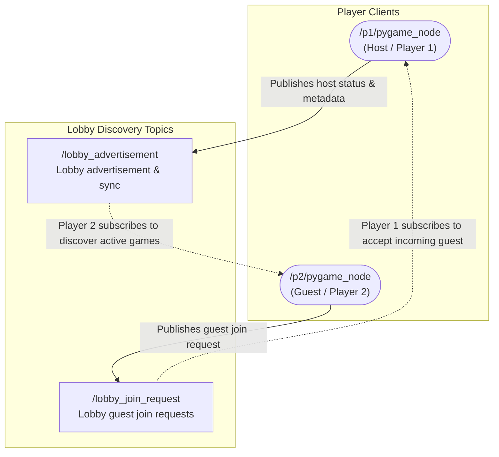

# Lobby Discovery & Matchmaking Flow

This document provides a simplified view of the **Lobby Discovery** and matchmaking handshake phase between the player clients, isolated from real-time gameplay topics.

## Discovery Handshake Graph

The diagram below shows how the host and guest visualizers discover each other and register for lobbies on the local network:



## Discovery Process

1. **Host Advertisement**:
   * The host client (`/p1/pygame_node`) **publishes** a serialized JSON string containing active lobby information (host name, player status, match status) to `/lobby_advertisement`.
   * Guest clients on the local network (`/p2/pygame_node`) **subscribe** to this topic to list available servers in their matchmaking lobby menu.

2. **Lobby Handshake**:
   * When a guest clicks "Join" in the UI, they **publish** a guest join request payload to `/lobby_join_request`.
   * The host client, who **subscribes** to `/lobby_join_request`, receives the payload, adds the guest to the lobby list, and changes the match status to `ready`.

## Message Payloads (JSON Formats)

Both discovery topics transmit standardized JSON payloads serialized as standard ROS 2 string messages (`std_msgs/msg/String`).

### 1. Lobby Advertisement Message (`/lobby_advertisement`)
Published by the lobby host to broadcast their existence, current players, match status, and active match ID.

**Example Payload:**
```json
{
  "host_id": "host_4821",
  "host_name": "Player_9524's Arena",
  "player1_name": "Player_9524",
  "player2_name": "Player_1032",
  "status": "ready",
  "match_id": "m18374"
}
```

**Field Explanations:**
* `host_id` (string): Unique identifier for the host visualizer node.
* `host_name` (string): Display name of the hosted game lobby shown to guest clients in the discovery menu.
* `player1_name` (string): The pilot name of Player 1 (the host).
* `player2_name` (string): The pilot name of Player 2 (blank if no guest has joined; populated once a join request is accepted).
* `status` (string): Current state of the lobby/match (`waiting`, `ready`, `playing`, `paused`, `game_over`, or `end`).
* `match_id` (string/null): The unique ID of the match, used to construct the namespaced topics (e.g., `/match/m18374/game_state`) once gameplay begins.

---

### 2. Lobby Join Request Message (`/lobby_join_request`)
Published by a guest client to request entry into a hosted lobby or signal departure.

**Example Payload:**
```json
{
  "host_id": "host_4821",
  "guest_name": "Player_1032",
  "guest_id": "host_2910"
}
```

**Field Explanations:**
* `host_id` (string): The identifier of the target lobby host the guest is trying to join.
* `guest_name` (string): The pilot name of the guest player (a blank value represents a request to leave the lobby).
* `guest_id` (string): Unique identifier for the guest client node.
