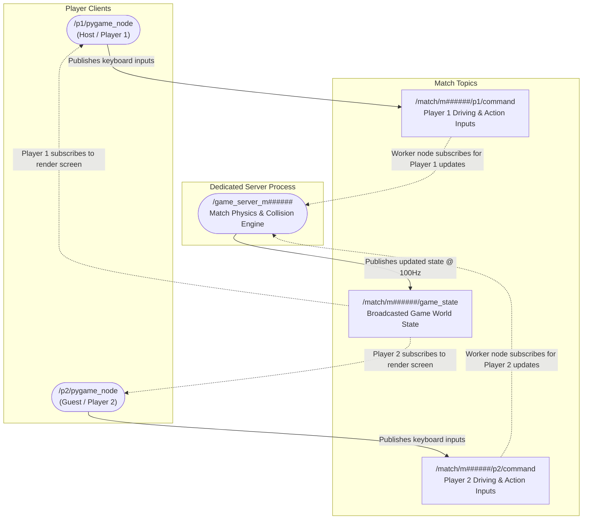

# Gameplay Match Communication Flow

This document details the real-time gameplay loop between the two player client nodes and the dedicated match worker node, isolated from lobby discovery and coordinator operations.

## Match Gameplay Graph

The diagram below shows the closed-loop communication that occurs at 100Hz during active gameplay:



## Gameplay Loop Steps

1. **Input Capture & Publishing**:
   * While the Pygame visualizer window is focused, it reads keyboard inputs (e.g., WASD for steering, space to fire).
   * The client node (`/p1/pygame_node` or `/p2/pygame_node`) compiles inputs into a `RobotCombatCommand` message and **publishes** it to its respective command topic: `/match/m######/p1/command` or `/match/m######/p2/command`.

2. **Physics Processing (Worker Node)**:
   * The dedicated match worker node (`/game_server_m######`) **subscribes** to both command topics.
   * On every physics tick (100Hz, `dt = 0.01s`), the worker node processes the incoming inputs, updates vehicle positions, resolves boundaries and collisions, calculates projectile trajectories, and checks for damage hits.

3. **State Broadcast & Rendering**:
   * The worker node packs the current frame's world state into a `GameState` message and **publishes** it to the `/match/m######/game_state` topic.
   * Both player clients, which **subscribe** to `/match/m######/game_state`, receive the message and draw the updated arena, score dashboards, and particle effects on screen at 60 FPS.

## Gameplay Message Specifications

The real-time gameplay loop relies on custom ROS 2 message definitions to exchange input controls and state snapshots between the clients and the match worker node.

### 1. Command Input Payload (`RobotCombatCommand`)
Sent from each player client node to the match worker to convey keyboard driving actions and combat triggers.

**Message Fields:**
* **Linear & Angular Speed (`linear_velocity`, `angular_velocity`)**: Float values representing the requested velocity of the robot chassis base.
* **Turret Orientation (`turret_angle`)**: Float angle representing the absolute aim direction of the robot turret barrel relative to the chassis base orientation.
* **Combat Actions (`shoot`, `shield`, `weapon_type`)**: Booleans and integers indicating whether the player triggered a standard projectile shot, deployed their shield bubble, or initiated a special 8-way radial attack.

**Example Payload Structure:**
```yaml
# Published on: /match/m######/p1/command
linear_velocity: 1.0       # Command: drive forward
angular_velocity: -0.5     # Command: rotate chassis base clockwise
turret_angle: 0.15         # Command: aim turret slightly counter-clockwise
shoot: false               # Standard laser not fired
shield: true               # Active defensive shield bubble triggered
weapon_type: 0             # Normal weapon type selected
```

---

### 2. Broadcasted Game State Payload (`GameState`)
Published by the match worker node to synchronize both player clients with the central physics world state.

**Message Fields:**
* **Round Information (`time_elapsed`, `game_over`)**: Monitors match duration and checks if a player has won.
* **Robot Vehicle States (`player1`, `player2`):** Bundles two nested `RobotState` message structs containing:
  * **Coordinates & Pose (`x`, `y`, `theta`, `turret_angle`)**: Exact position and joint orientation of the chassis and turret.
  * **Dashboard Statistics (`health`, `score`, `ammo`)**: Health points, score metrics, and current ammunition count.
  * **Defensive Matrix (`shield_active`, `shield_energy`)**: Monitors if the shield bubble is currently active and checks remaining shield energy.
* **Active Projectiles (`projectiles`):** An array of active `Projectile` structs detailing each projectile currently moving in the arena:
  * **Tracking metadata (`id`, `owner`)**: Unique projectile ID and identification of the shooter (Player 1 vs Player 2).
  * **Physics data (`x`, `y`, `vx`, `vy`)**: Position coordinates and speed vectors.
  * **Weapon type (`type`)**: Identifies normal projectiles versus special 8-way radial projectiles.

**Example Payload Structure:**
```yaml
# Published on: /match/m######/game_state
game_over: false
time_elapsed: 14.85
player1:
  x: -1.24
  y: 0.35
  theta: 0.12
  turret_angle: 0.15
  health: 90
  shield_active: true
  shield_energy: 70.0
  score: 10
  ammo: 8
player2:
  x: 1.10
  y: -0.45
  theta: 3.02
  turret_angle: -0.05
  health: 100
  shield_active: false
  shield_energy: 100.0
  score: 0
  ammo: 10
projectiles:
  - id: 48
    x: 0.25
    y: 0.12
    vx: 6.0
    vy: 0.8
    type: 0
    owner: 1
```
