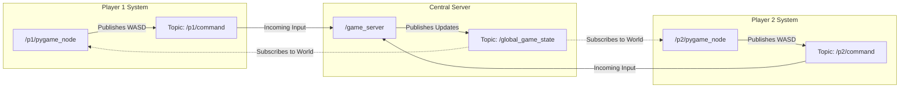

# ROS 2 Computation Graph (`rqt_graph`) Explanation

This document explains the active ROS 2 nodes and the topic arrows connecting them, as visualized in the `rqt_graph` computation topology.

---

## 🟢 Nodes (The Ovals)

These are active, independent execution processes running within the ROS 2 workspace.

### 1. `/p1/pygame_node` and `/p2/pygame_node`
* **Source**: [pygame_visualizer.py](file:///home/syphon/arena_battle/src/arena_battle/arena_battle/pygame_visualizer.py)
* **Description**: The unified player client application. It acts as both the **View** (rendering the arena, particles, projectiles, and HUD) and the **Controller** (polling keyboard events and translating them to movement/action messages).

### 2. `/game_server`
* **Source**: [game_logic.py](file:///home/syphon/arena_battle/src/arena_battle/arena_battle/game_logic.py)
* **Description**: The central game server (the **Model**). It runs the physics engine at 50Hz, enforces arena boundary constraints, resolves robot-to-robot push collisions, computes damage math, and updates game statistics (scores, ammo, health).

---

## ➡️ Topic Arrows (The Connections)

Arrows show the direction of **data flow** (from a publisher to a subscriber).

### 1. `/lobby_join_request`
* **Path**: `/p1/pygame_node` $\rightarrow$ `/p1/pygame_node` (or `/p2/pygame_node` self-loop)
* **Purpose**: Coordinates players joining hosted game lobbies.
* **Explanation**: Because the guest lobby registration and host client registration are managed within the same unified `pygame_visualizer` node code, the process registers both a publisher (sending join requests) and a subscriber (listening for guest requests to update host lobby listings).

### 2. `/lobby_advertisement` (Self-loop)
* **Path**: `/p1/pygame_node` $\rightarrow$ `/p1/pygame_node` (or `/p2/pygame_node` self-loop)
* **Purpose**: Enables local server discovery on the LAN network.
* **Explanation**: A hosting client regularly broadcasts lobby details (server name, status, pilot names) on this topic. Guest clients subscribe to this topic to list available LAN games in the main menu. Both functions exist inside the visualizer script, creating the loopback.

### 3. `/lobby_advertisement` (To Server)
* **Path**: `/p1/pygame_node` $\rightarrow$ `/game_server`
* **Purpose**: Updates server status and resets matches dynamically.
* **Explanation**: The `/game_server` node listens to this topic so that it can monitor lobby status transitions (e.g., from `waiting` to `playing`). The server automatically resets and starts the physics loop when a hosted lobby enters `playing` status, and pauses updates if players return to lobby setup.

### 4. `/p1/command`
* **Path**: `/p1/pygame_node` $\rightarrow$ `/game_server`
* **Purpose**: Transmits controls for the Cyan Robot (Player 1).
* **Explanation**: Sends commands like linear/angular velocity, turret orientation, shields, and fire triggers from the Player 1 client GUI keyboard reader to the physics engine.

### 5. `/p2/command`
* **Path**: `/p2/pygame_node` $\rightarrow$ `/game_server`
* **Purpose**: Transmits controls for the Magenta Robot (Player 2).
* **Explanation**: Sends commands like linear/angular velocity, turret orientation, shields, and fire triggers for Player 2 to the physics engine.

### 6. `/global_game_state`
* **Path**: `/game_server` $\rightarrow$ `/p1/pygame_node` & `/p2/pygame_node`
* **Purpose**: Broadcasts the absolute game state to the visualizers.
* **Explanation**: The physics engine broadcasts the updated coordinates/angles of robots, health bars, ammunition counts, scores, and active projectiles. The visualizers subscribe to this topic to redraw the gameplay screen at 60 FPS.
